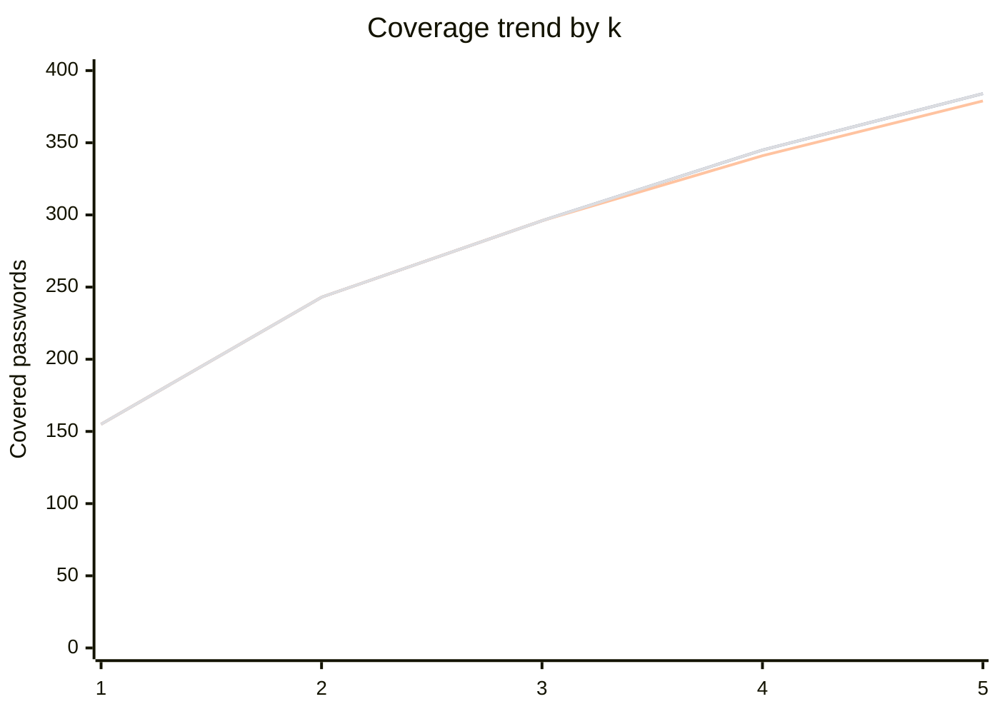

# Algorithm Comparisons

Tài liệu này tổng hợp số liệu so sánh các giải thuật trên cùng bộ dữ liệu hiện tại của project:

- `real_passwords.txt`: 500 password thật
- `mutated_passwords.txt`: 1500 password biến đổi
- `rules.py`: 20 rules

Số liệu được đo trực tiếp trong môi trường hiện tại bằng:

- `time.perf_counter()` cho thời gian chạy
- `tracemalloc` cho bộ nhớ hiện tại và bộ nhớ đỉnh
- cùng một input cho mọi solver ở từng mức `k`

Mục tiêu:

- so sánh khả năng bao phủ của từng giải thuật
- so sánh độ ổn định theo `k`
- so sánh thời gian chạy và mức tiêu thụ bộ nhớ

---

## 1. Bảng so sánh lớn

Các cột dùng trong bảng:

- `Coverage`: số password thật được phủ trên tổng 500 password
- `Time`: thời gian chạy tính bằng giây
- `Current KB`: bộ nhớ đang dùng tại thời điểm đo
- `Peak KB`: bộ nhớ đỉnh trong quá trình chạy

### 1.1. Visual summary

| Algorithm | k=1 Coverage | k=1 Time (s) | k=1 Current KB | k=1 Peak KB | k=2 Coverage | k=2 Time (s) | k=2 Current KB | k=2 Peak KB | k=3 Coverage | k=3 Time (s) | k=3 Current KB | k=3 Peak KB | k=4 Coverage | k=4 Time (s) | k=4 Current KB | k=4 Peak KB | k=5 Coverage | k=5 Time (s) | k=5 Current KB | k=5 Peak KB |
|---|---:|---:|---:|---:|---:|---:|---:|---:|---:|---:|---:|---:|---:|---:|---:|---:|---:|---:|---:|---:|
| Brute Force | 155/500 | 0.100968 | 14.80 | 306.33 | 243/500 | 0.104654 | 16.84 | 306.33 | 296/500 | 0.105032 | 23.05 | 303.17 | 345/500 | 0.141945 | 27.29 | 306.33 | 384/500 | 0.288938 | 25.70 | 303.17 |
| Greedy | 155/500 | 0.092709 | 11.78 | 303.22 | 243/500 | 0.098235 | 13.82 | 303.22 | 296/500 | 0.096513 | 22.89 | 303.17 | 345/500 | 0.094783 | 24.25 | 303.22 | 384/500 | 0.102534 | 25.22 | 303.17 |
| Randomized Search | 155/500 | 0.199362 | 16.98 | 477.17 | 243/500 | 0.220159 | 19.02 | 477.17 | 296/500 | 0.202203 | 27.26 | 477.04 | 345/500 | 0.200207 | 29.47 | 477.17 | 384/500 | 0.207505 | 29.58 | 477.04 |
| Hill Climbing | 155/500 | 0.207597 | 19.42 | 474.25 | 243/500 | 0.190980 | 21.46 | 474.25 | 296/500 | 0.210180 | 27.15 | 474.25 | 345/500 | 0.212835 | 31.91 | 474.25 | 384/500 | 0.195348 | 29.47 | 474.25 |
| Local Search | 155/500 | 0.094665 | 11.86 | 303.17 | 243/500 | 0.121583 | 14.01 | 303.17 | 296/500 | 0.107304 | 23.41 | 303.17 | 345/500 | 0.107283 | 24.73 | 303.17 | 384/500 | 0.102161 | 25.86 | 303.17 |
| Beam Search | 155/500 | 0.093895 | 14.23 | 303.17 | 243/500 | 0.119633 | 31.28 | 956.68 | 296/500 | 0.102556 | 38.18 | 886.55 | 341/500 | 0.114864 | 43.88 | 1178.26 | 379/500 | 0.135714 | 30.49 | 1031.51 |
| Dynamic Programming | 155/500 | 0.092624 | 188.38 | 303.29 | 243/500 | 0.094902 | 1503.71 | 1567.23 | 296/500 | 0.127033 | 11666.32 | 11730.52 | 345/500 | 0.262738 | 69007.14 | 69081.11 | 384/500 | 0.891359 | 288793.01 | 288878.69 |
| ILP + PuLP + CBC | 155/500 | 0.449353 | 40.26 | 1828.07 | 243/500 | 0.271465 | 42.40 | 1828.22 | 296/500 | 0.756767 | 39.92 | 1798.16 | 345/500 | 1.711828 | 52.88 | 1828.27 | 384/500 | 3.715524 | 42.32 | 1798.16 |
| Lagrangian Relaxation | 155/500 | 0.110276 | 11.70 | 303.17 | 243/500 | 0.138018 | 13.74 | 303.17 | 296/500 | 0.138566 | 23.02 | 303.17 | 345/500 | 0.146993 | 24.19 | 303.17 | 384/500 | 0.151659 | 25.21 | 303.17 |

---

## 2. Selected rules by solver

### 2.1. k = 1

Tất cả solver đều chọn cùng một rule:

- `selected_rule_ids = [6]`
- `selected_rule_names = append_single_digit`

Coverage:

- `155 / 500`

### 2.2. k = 3

| Algorithm | Selected rule IDs | Selected rules | Coverage |
|---|---|---|---:|
| Brute Force | `[2, 4, 6]` | `identity_medium`, `capitalize`, `append_single_digit` | 296/500 |
| Greedy | `[6, 2, 4]` | `append_single_digit`, `identity_medium`, `capitalize` | 296/500 |
| Randomized Search | `[6, 2, 4]` | `append_single_digit`, `identity_medium`, `capitalize` | 296/500 |
| Hill Climbing | `[2, 4, 6]` | `identity_medium`, `capitalize`, `append_single_digit` | 296/500 |
| Local Search | `[2, 6, 12]` | `identity_medium`, `append_single_digit`, `prepend_123` | 296/500 |
| Beam Search | `[2, 6, 12]` | `identity_medium`, `append_single_digit`, `prepend_123` | 296/500 |
| Dynamic Programming | `[2, 4, 6]` | `identity_medium`, `capitalize`, `append_single_digit` | 296/500 |
| ILP + PuLP + CBC | `[2, 4, 6]` | `identity_medium`, `capitalize`, `append_single_digit` | 296/500 |
| Lagrangian Relaxation | `[2, 6, 12]` | `identity_medium`, `append_single_digit`, `prepend_123` | 296/500 |

### 2.3. k = 4

| Algorithm | Selected rule IDs | Selected rules | Coverage |
|---|---|---|---:|
| Brute Force | `[2, 4, 6, 12]` | `identity_medium`, `capitalize`, `append_single_digit`, `prepend_123` | 345/500 |
| Greedy | `[6, 2, 4, 12]` | `append_single_digit`, `identity_medium`, `capitalize`, `prepend_123` | 345/500 |
| Randomized Search | `[6, 2, 4, 12]` | `append_single_digit`, `identity_medium`, `capitalize`, `prepend_123` | 345/500 |
| Hill Climbing | `[2, 4, 6, 12]` | `identity_medium`, `capitalize`, `append_single_digit`, `prepend_123` | 345/500 |
| Local Search | `[2, 4, 6, 12]` | `identity_medium`, `capitalize`, `append_single_digit`, `prepend_123` | 345/500 |
| Beam Search | `[2, 6, 12, 14]` | `identity_medium`, `append_single_digit`, `prepend_123`, `leet_a4` | 341/500 |
| Dynamic Programming | `[2, 4, 6, 12]` | `identity_medium`, `capitalize`, `append_single_digit`, `prepend_123` | 345/500 |
| ILP + PuLP + CBC | `[2, 4, 6, 12]` | `identity_medium`, `capitalize`, `append_single_digit`, `prepend_123` | 345/500 |
| Lagrangian Relaxation | `[2, 4, 6, 12]` | `identity_medium`, `capitalize`, `append_single_digit`, `prepend_123` | 345/500 |

### 2.4. k = 2

| Algorithm | Selected rule IDs | Selected rules | Coverage |
|---|---|---|---:|
| Brute Force | `[2, 6]` | `identity_medium`, `append_single_digit` | 243/500 |
| Greedy | `[6, 2]` | `append_single_digit`, `identity_medium` | 243/500 |
| Randomized Search | `[6, 2]` | `append_single_digit`, `identity_medium` | 243/500 |
| Hill Climbing | `[2, 6]` | `identity_medium`, `append_single_digit` | 243/500 |
| Local Search | `[2, 6]` | `identity_medium`, `append_single_digit` | 243/500 |
| Beam Search | `[2, 6]` | `identity_medium`, `append_single_digit` | 243/500 |
| Dynamic Programming | `[2, 6]` | `identity_medium`, `append_single_digit` | 243/500 |
| ILP + PuLP + CBC | `[2, 6]` | `identity_medium`, `append_single_digit` | 243/500 |
| Lagrangian Relaxation | `[2, 6]` | `identity_medium`, `append_single_digit` | 243/500 |

### 2.5. k = 5

| Algorithm | Selected rule IDs | Selected rules | Coverage |
|---|---|---|---:|
| Brute Force | `[2, 4, 6, 12, 14]` | `identity_medium`, `capitalize`, `append_single_digit`, `prepend_123`, `leet_a4` | 384/500 |
| Greedy | `[6, 2, 4, 12, 14]` | `append_single_digit`, `identity_medium`, `capitalize`, `prepend_123`, `leet_a4` | 384/500 |
| Randomized Search | `[6, 2, 4, 12, 14]` | `append_single_digit`, `identity_medium`, `capitalize`, `prepend_123`, `leet_a4` | 384/500 |
| Hill Climbing | `[2, 4, 6, 12, 14]` | `identity_medium`, `capitalize`, `append_single_digit`, `prepend_123`, `leet_a4` | 384/500 |
| Local Search | `[2, 4, 6, 12, 14]` | `identity_medium`, `capitalize`, `append_single_digit`, `prepend_123`, `leet_a4` | 384/500 |
| Beam Search | `[2, 6, 12, 14, 15]` | `identity_medium`, `append_single_digit`, `prepend_123`, `leet_a4`, `leet_o0` | 379/500 |
| Dynamic Programming | `[2, 4, 6, 12, 14]` | `identity_medium`, `capitalize`, `append_single_digit`, `prepend_123`, `leet_a4` | 384/500 |
| ILP + PuLP + CBC | `[2, 4, 6, 12, 14]` | `identity_medium`, `capitalize`, `append_single_digit`, `prepend_123`, `leet_a4` | 384/500 |
| Lagrangian Relaxation | `[2, 4, 6, 12, 14]` | `identity_medium`, `capitalize`, `append_single_digit`, `prepend_123`, `leet_a4` | 384/500 |

---

## 3. Nhận xét chính

### 3.1. Về khả năng bao phủ

- Với `k = 1`, tất cả solver đều chọn rule số `6` và phủ `155/500` password.
- Với `k = 3`, đa số solver đạt cùng mức phủ `296/500`.
- Với `k = 4`, phần lớn solver đạt `345/500`, riêng `Beam Search` chỉ đạt `341/500` trong lần đo này.

### 3.2. Về thời gian chạy

- `Greedy` và `Local Search` thuộc nhóm nhanh nhất trong bộ đo này.
- `Randomized Search` và `Hill Climbing` chậm hơn một chút do phải thử nhiều phương án hoặc swap.
- `ILP + PuLP + CBC` có overhead lớn hơn các heuristic.
- `Dynamic Programming` nhanh ở `k` nhỏ nhưng tăng rất mạnh khi `k` lớn hơn.

### 3.3. Về bộ nhớ

- `Dynamic Programming` là solver tiêu tốn bộ nhớ lớn nhất.
- Ở `k = 4`, bộ nhớ đỉnh của `Dynamic Programming` tăng lên khoảng `69081.11 KB`.
- `ILP + PuLP + CBC` cũng dùng bộ nhớ đáng kể do mô hình tối ưu và solver backend.
- Các heuristic như `Greedy`, `Local Search`, `Lagrangian Relaxation` có bộ nhớ khá ổn định quanh mức thấp.

### 3.4. Về độ chính xác

- `Brute Force`, `Dynamic Programming`, và `ILP + PuLP + CBC` cho cùng coverage trên các bài nhỏ trong bảng.
- `Greedy` trong bộ dữ liệu này đạt đúng nghiệm tối ưu ở các mức `k` đã đo.
- `Beam Search` có thể bỏ sót nghiệm tốt hơn nếu beam width không đủ rộng.

---

## 4. Kết luận ngắn

Nếu ưu tiên:

- **độ chính xác tuyệt đối**: dùng `Brute Force`, `Dynamic Programming`, hoặc `ILP + PuLP + CBC` cho bài nhỏ
- **tốc độ**: dùng `Greedy` hoặc `Local Search`
- **thử nghiệm heuristic**: dùng `Randomized Search`, `Hill Climbing`, `Beam Search`, `Lagrangian Relaxation`

Trong bộ dữ liệu hiện tại, `Greedy` là lựa chọn cân bằng tốt giữa:

- coverage
- thời gian chạy
- bộ nhớ sử dụng

---

## 5. Snapshots tới k = 20

Để giữ tài liệu dễ đọc, phần này gom các mốc quan trọng `k = 6, 10, 15, 20`.
Mỗi ô có dạng:

`coverage | time (s) | current KB | peak KB`

| Algorithm | k=6 | k=10 | k=15 | k=20 |
|---|---|---|---|---|
| Brute Force | 417/500 \| 0.575650 \| 29.46 \| 306.33 | 485/500 \| 2.696830 \| 29.56 \| 303.17 | 499/500 \| 0.392717 \| 29.19 \| 303.17 | 499/500 \| 0.090590 \| 29.23 \| 303.17 |
| Greedy | 417/500 \| 0.101653 \| 26.35 \| 303.22 | 483/500 \| 0.100296 \| 27.98 \| 303.17 | 499/500 \| 0.098214 \| 28.45 \| 303.17 | 499/500 \| 0.095224 \| 28.87 \| 303.17 |
| Randomized Search | 417/500 \| 0.206663 \| 31.55 \| 477.17 | 483/500 \| 0.226250 \| 32.31 \| 477.08 | 499/500 \| 0.220132 \| 32.83 \| 477.08 | 499/500 \| 0.202348 \| 33.22 \| 477.08 |
| Hill Climbing | 417/500 \| 0.188611 \| 33.99 \| 474.25 | 484/500 \| 0.196165 \| 32.26 \| 474.25 | 499/500 \| 0.197961 \| 32.72 \| 474.25 | 499/500 \| 0.182865 \| 33.11 \| 474.25 |
| Local Search | 417/500 \| 0.102615 \| 26.65 \| 303.17 | 484/500 \| 0.109074 \| 28.70 \| 303.17 | 499/500 \| 0.113301 \| 28.79 \| 303.17 | 499/500 \| 0.089304 \| 28.84 \| 303.17 |
| Beam Search | 408/500 \| 0.094766 \| 45.73 \| 914.04 | 468/500 \| 0.141654 \| 47.88 \| 797.77 | 498/500 \| 0.095196 \| 45.46 \| 612.78 | 499/500 \| 0.095207 \| 28.84 \| 303.17 |
| Dynamic Programming | 417/500 \| 2.206707 \| 848770.76 \| 848872.07 | 485/500 \| 23.061716 \| 5781944.74 \| 5782125.64 | 499/500 \| 3.452919 \| 812608.00 \| 812873.03 | 499/500 \| 0.093413 \| 417.97 \| 761.58 |
| ILP + PuLP + CBC | 417/500 \| 7.923087 \| 55.57 \| 1828.77 | 485/500 \| 1.718747 \| 47.26 \| 1815.22 | 499/500 \| 0.394287 \| 47.67 \| 1815.22 | 499/500 \| 0.370473 \| 45.20 \| 1797.37 |
| Lagrangian Relaxation | 417/500 \| 0.237387 \| 26.27 \| 303.17 | 485/500 \| 0.155495 \| 28.05 \| 303.17 | 499/500 \| 0.185394 \| 28.45 \| 303.17 | 499/500 \| 0.167719 \| 28.84 \| 303.17 |

### 5.1. High-k observations

- Từ `k = 16` trở đi, phần lớn solver đã đạt `499/500`, tức gần như phủ tối đa toàn bộ dữ liệu.
- `Greedy`, `Local Search`, và `Lagrangian Relaxation` giữ bộ nhớ khá ổn định, peak thường quanh `303 KB`.
- `Dynamic Programming` tăng bộ nhớ rất mạnh ở vùng giữa `k = 6..15`, đặc biệt đạt đỉnh hơn `5,781,000 KB` tại `k = 10`.
- `ILP + PuLP + CBC` có thời gian chạy cao ở `k = 6`, nhưng ổn định hơn khi `k` tăng.
- `Beam Search` vẫn có khả năng hụt so với nghiệm tốt nhất ở một số mốc giữa, nhưng tới `k = 20` thì đạt `499/500`.
- `Brute Force` ở `k` lớn giảm áp lực tổ hợp vì số cách chọn rất ít khi `k` tiến gần `20`.

---

## 6. Full coverage matrix for k = 1..20

Bảng này chỉ tập trung vào mức độ bao phủ để giữ cho tài liệu đọc được.
Các số liệu thời gian và bộ nhớ đã được lưu ở các phần snapshot phía trên.

| k | Brute Force | Greedy | Randomized Search | Hill Climbing | Local Search | Beam Search | Dynamic Programming | ILP + PuLP + CBC | Lagrangian Relaxation |
|---|---:|---:|---:|---:|---:|---:|---:|---:|---:|
| 1 | 155/500 | 155/500 | 155/500 | 155/500 | 155/500 | 155/500 | 155/500 | 155/500 | 155/500 |
| 2 | 243/500 | 243/500 | 243/500 | 243/500 | 243/500 | 243/500 | 243/500 | 243/500 | 243/500 |
| 3 | 296/500 | 296/500 | 296/500 | 296/500 | 296/500 | 296/500 | 296/500 | 296/500 | 296/500 |
| 4 | 345/500 | 345/500 | 345/500 | 345/500 | 345/500 | 341/500 | 345/500 | 345/500 | 345/500 |
| 5 | 384/500 | 384/500 | 384/500 | 384/500 | 384/500 | 379/500 | 384/500 | 384/500 | 384/500 |
| 6 | 417/500 | 417/500 | 417/500 | 417/500 | 417/500 | 408/500 | 417/500 | 417/500 | 417/500 |
| 7 | 441/500 | 440/500 | 440/500 | 440/500 | 441/500 | 428/500 | 441/500 | 441/500 | 440/500 |
| 8 | 460/500 | 459/500 | 459/500 | 459/500 | 459/500 | 437/500 | 460/500 | 460/500 | 460/500 |
| 9 | 474/500 | 472/500 | 472/500 | 472/500 | 474/500 | 456/500 | 474/500 | 474/500 | 474/500 |
| 10 | 485/500 | 483/500 | 483/500 | 484/500 | 484/500 | 468/500 | 485/500 | 485/500 | 485/500 |
| 11 | 493/500 | 490/500 | 490/500 | 491/500 | 491/500 | 480/500 | 493/500 | 493/500 | 493/500 |
| 12 | 498/500 | 495/500 | 495/500 | 498/500 | 495/500 | 484/500 | 498/500 | 498/500 | 498/500 |
| 13 | 499/500 | 498/500 | 498/500 | 499/500 | 497/500 | 493/500 | 499/500 | 499/500 | 499/500 |
| 14 | 499/500 | 499/500 | 499/500 | 499/500 | 499/500 | 495/500 | 499/500 | 499/500 | 499/500 |
| 15 | 499/500 | 499/500 | 499/500 | 499/500 | 499/500 | 498/500 | 499/500 | 499/500 | 499/500 |
| 16 | 499/500 | 499/500 | 499/500 | 499/500 | 499/500 | 499/500 | 499/500 | 499/500 | 499/500 |
| 17 | 499/500 | 499/500 | 499/500 | 499/500 | 499/500 | 499/500 | 499/500 | 499/500 | 499/500 |
| 18 | 499/500 | 499/500 | 499/500 | 499/500 | 499/500 | 499/500 | 499/500 | 499/500 | 499/500 |
| 19 | 499/500 | 499/500 | 499/500 | 499/500 | 499/500 | 499/500 | 499/500 | 499/500 | 499/500 |
| 20 | 499/500 | 499/500 | 499/500 | 499/500 | 499/500 | 499/500 | 499/500 | 499/500 | 499/500 |
